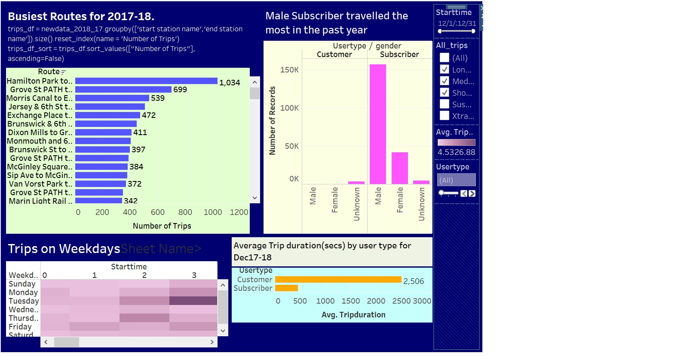
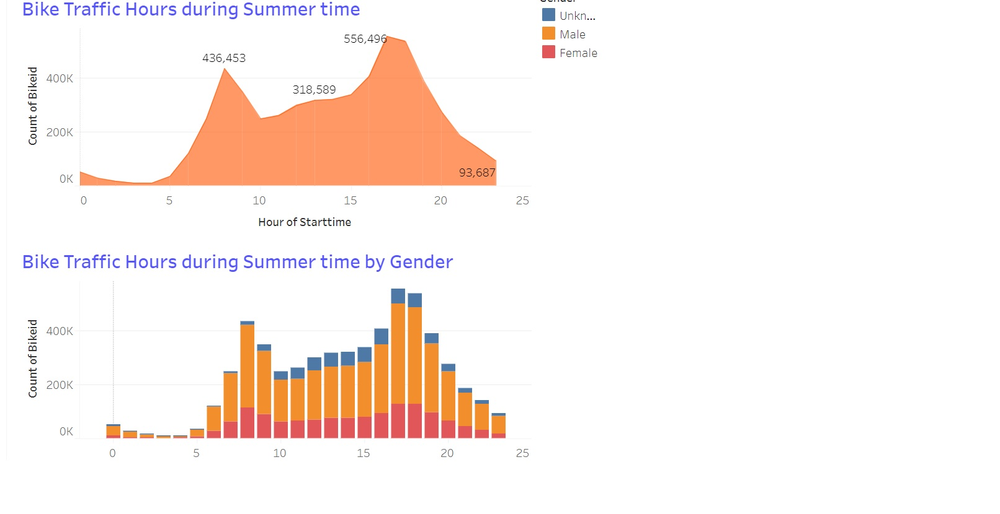
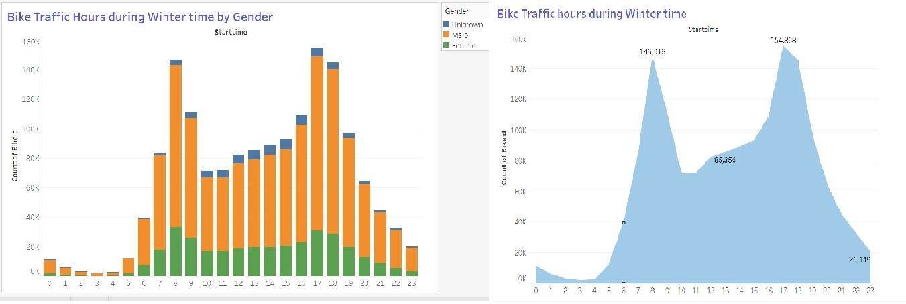

# Tableau - Citi Bike Analytics
This project shows an analysis on New York Citi Bike Program. here I have downloaded files from CitiBike Trip Data (https://www.citibikenyc.com/system-data). In order to capture the latest and most relevant data, I looked at the latest year's data from Dec 2017 to Dec 2018 (201712-citibike-tripdata.csv.zip to 201812-citibike-tripdata.csv.zip).

Since all columns were the same, I merged all twelve csvs into one csv file using Python's Pandas library. A groupby and then sort was also done on Station Names to create a new csv file that shows visualization of top popular routes in past one year. 

## Analysis is performed on data gathered from Dec 17 till Dec 18

(Popular Trips.twbx)
(https://public.tableau.com/profile/niharika.sachdeva#!/vizhome/populartrips/Dashboarddec17-dec18)
* Above dashboard shows visualization of popular routes in descending order,
* Depicts that Male gender from Subcriber usertype has travelled the most
* Dashboard also shows that Unknown Gender type at the age of late 40s have travelled the most.

![Dashboard - Peak Summer Hours(May-July 2018)]
(https://public.tableau.com/profile/niharika.sachdeva#!/vizhome/PeakHourssummer/Dashboard1)
(Peak Hours summer.twbx)

![Dashboard - Peak Winter Hours(Dec2017-Feb 2018)]
(https://public.tableau.com/profile/niharika.sachdeva#!/vizhome/PeakWinterhours/Dashboard1)
(Peak Winter hours.twbx)

![Dashboard - Bike Station on Map(Dec2017-Feb 2018)]
(Bike Stations.twbx)
(https://public.tableau.com/profile/niharika.sachdeva#!/vizhome/BikeStations_0/Dashboard1)

* Grove St path,Hamilton Park,Slip Ave have been the busiest starting and ending stations for year 2018.

## Copyright

Niharika Sachdeva 2019. All Rights Reserved.
